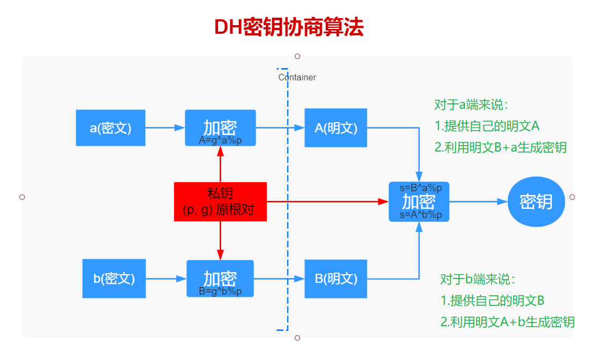

# Android网络安全之加解密
参考：https://www.imooc.com/learn/1214

## OpenSSL相关命令

### 生成私钥
genrsa -out rsa_private_key.pem 1024

### 生成公钥
rsa -in rsa_private_key_cs8.pem -pubout -out rsa_public_key_cs8.pem

### 把RSA私钥转换成PKCS8格式
>以前的写法：
pkcs8 -topk8 -inform PEM -in rsa_private_key.pem -outform pem –nocrypt

>最新的写法：参考：https://www.jianshu.com/p/aa04380b7965
pkcs8 -in rsa_private_key.pem -topk8 -out rsa_private_key_cs8.pem -nocrypt